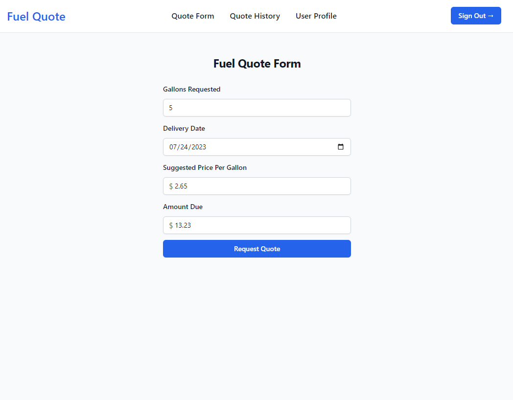
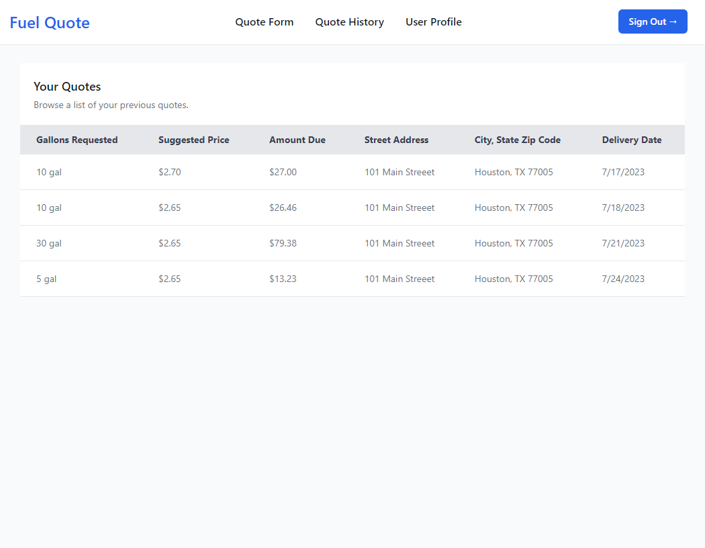

# Fuel Quote

A full stack single page fuel pricing application with state-based discounts and quote history

### Screenshot




### Built with:

- JavaScript
- Tailwind CSS
- React using Vite
- Redux
- Node.js
- Express.js
- MongoDB

### It includes the following:

- JWT authentication stored in HTTP-only cookie
- Backend API with Express & MongoDB
- Protected routes and endpoints
- Custom middleware
- MongoDB database to store users and quotes
- Backend unit tests with Jest

### Install Dependencies
```
npm install
cd frontend
npm install
```

### Env Variables
```
NODE_ENV = development
PORT = 3001
MONGO_URI = your mongodb uri
JWT_SECRET = 'yourJwtSecrect'
```

### Run Backend
```
npm run server
```

### Run Frontend
```
cd frontend
npm run dev
```
